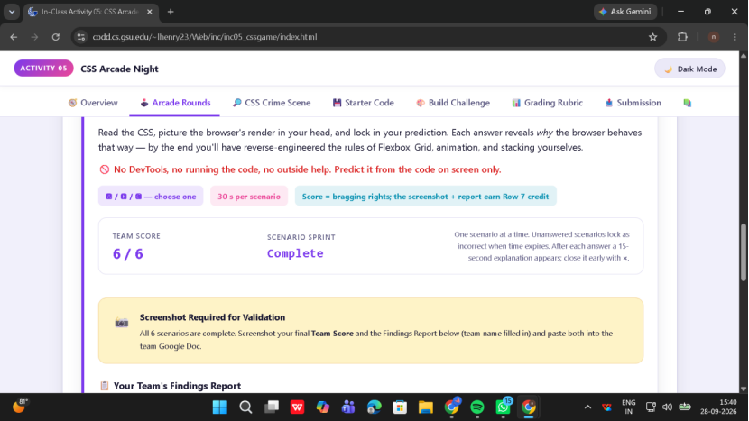
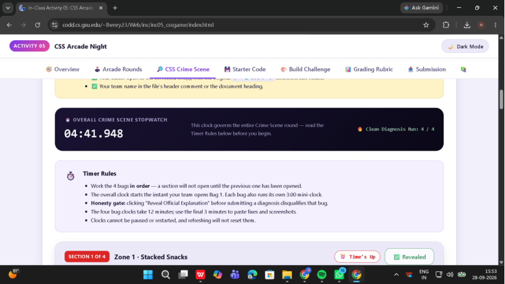
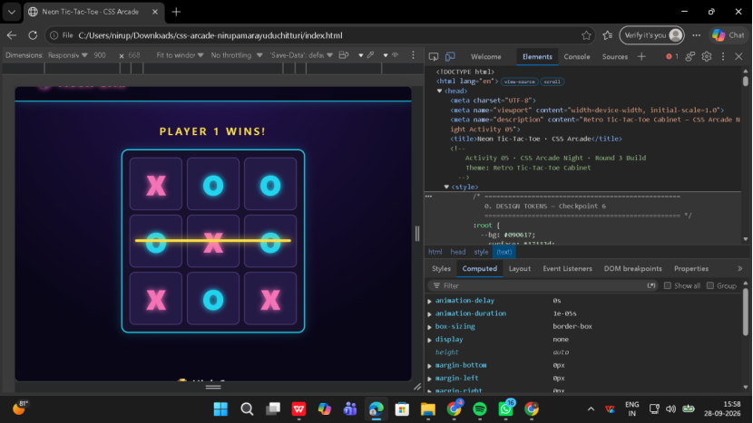

# CSS Arcade Night — Neon Grid

## Team Members

- Nirupamarayudu Chitturi — 002931435
- Shared evidence document: `Activity05-NeonGrid-Evidence.docx`
- Shared Google Doc URL: **paste the link here after uploading/converting the evidence document to Google Docs**

## Repository & Live URL

- GitHub repository: https://github.com/ChNirupam/css-arcade-neon-grid
- GitHub Pages live URL: https://chnirupam.github.io/css-arcade-neon-grid/

## Build Challenge

**Theme:** Retro Tic-Tac-Toe Cabinet

The cabinet is a neon one-page Tic-Tac-Toe experience with a flex header/navigation bar, 3 × 3 CSS Grid board, animated winner message and winning line, keyboard/hover interactions, responsive behavior, and a layered champion showpiece.

### Mandatory CSS Checkpoints

1. **Flexbox Layout** → `.cabinet-header`, `.cabinet-nav`
   - Uses `display: flex`, `justify-content`, `align-items`, and `gap`.
   - At mobile width the header changes to a column layout.

2. **CSS Grid Board** → `.game-grid`
   - Uses `display: grid`.
   - Defines three tracks with `grid-template-columns: repeat(3, minmax(80px, 120px));`.
   - Nine tiles form a 3 × 3 board.

3. **Keyframe Animation** → `.marquee-text`, `.win-line`
   - `@keyframes attract-mode` and `@keyframes winning-line` each use 0%, 50%, and 100% stops.
   - Uses `transform`, delay, and `both` fill mode.

4. **Positioning & z-index** → `.layer-stack`, `.layer-back`, `.layer-mid`, `.layer-front`
   - `.layer-stack` is `position: relative` with `z-index: 0`.
   - Child layers are `position: absolute` with explicit `z-index: 1`, `2`, and `3`.

5. **Micro-Interaction** → `.tile:hover`, `.tile:focus-visible`, nav hover/focus rules
   - Uses `transition` with `transform`, `box-shadow`, and border changes.

6. **Professional & Responsive** → `:root`, semantic HTML, media query
   - Uses custom properties and no inline styles.
   - `@media (max-width: 768px)` changes the header/grid sizing.
   - Includes optional reduced-motion handling.

## Round 1 Findings



**Final Team Score: 6 / 6**

1. **Cookie Menu Row** — Flexbox defaults to a horizontal row. `justify-content: space-between` puts the outer cards at the edges with equal space between items.
2. **Tic-Tac-Toe Board** — Three grid columns create the intended 3 × 3 board for nine cells.
3. **Axis Flip** — With `flex-direction: column`, the cross axis is horizontal, so `align-items: center` centers horizontally.
4. **Fraction Launch** — The `1s` in the animation shorthand is the animation delay.
5. **Snap-Back** — Without a fill mode, the animated element returns to its normal style after the animation finishes.
6. **Missing Heart** — Without positioning, the heart remains in normal flow and its offsets/intended z-index behavior do not work as intended.

## Round 2 Bug Fixes



### Bug 1 — Flexbox Axis

```css
.recipe-row {
  display: flex;
  flex-direction: row;
  justify-content: space-between;
  gap: 1rem;
}
```

`flex-direction` controls the main axis. The broken value `column` stacked the cards vertically; changing it to `row` creates the intended horizontal layout.

### Bug 2 — Grid Tracks

```css
.board {
  display: grid;
  grid-template-columns: repeat(3, 100px);
}
```

The broken version declared only two columns, so the browser auto-placed the extra cells into more rows. Three explicit columns produce a 3 × 3 board.

### Bug 3 — Animation Fill Mode

```css
#answer {
  animation: moveFraction 3s ease-in-out 1s both;
}
```

The `both` fill mode applies the first keyframe during the delay and preserves the final keyframe after completion.

### Bug 4 — Positioning & z-index

```css
.heart {
  position: absolute;
  top: 110px;
  left: 0;
  right: 0;
  z-index: 10;
}
```

The heart was missing a positioning rule. `position: absolute` makes its offsets work relative to the positioned shirt wrapper and allows the intended stacking order.

## Round 3 Cabinet / DevTools Evidence



### Live Defense Answers

**1. Flex container:** `.cabinet-header` is the main flex container. To flip the main axis from horizontal to vertical, use `flex-direction: column`.

**2. Grid tracks:** `.game-grid` defines three column tracks with `grid-template-columns: repeat(3, minmax(80px, 120px));`. Enable the Grid overlay in DevTools on this element.

**3. Stacking context:** `.layer-stack` uses `position: relative` and `z-index: 0`, creating a local stacking context. Its absolutely positioned child layers use z-index values 1, 2, and 3; `.layer-front` wins because it has the highest value.

## Files Included

- `index.html` — finished Round 3 cabinet with embedded stylesheet
- `css_arcade_broken.html` — corrected Round 2 practice file
- `README.md` — complete project documentation
- `Activity05-NeonGrid-Evidence.docx` — exported evidence document ready to upload/convert to Google Docs
- `NeonGrid-Round1-Score.png`
- `NeonGrid-Round2-BugProof.png`
- `NeonGrid-Cabinet-DevTools.png`
- `ICOLLEGE_SUBMISSION_TEXT.txt`
- `GITHUB_SETUP.txt`
- `LIVE_DEFENSE.txt`
